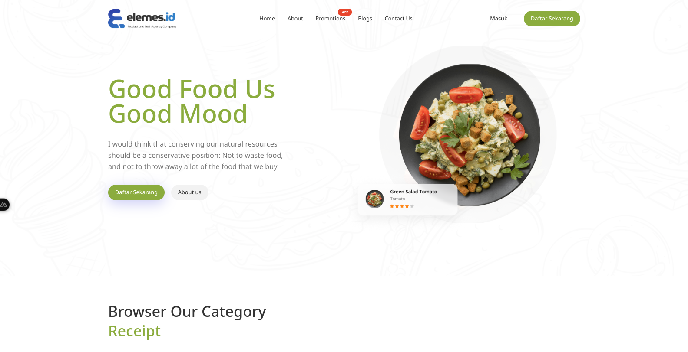

# Test Coding Elemes.id

This website is a front-end developer coding test at Elemes group
[Live Preview](https://elemes-test-murex.vercel.app/)



## Installation

Pertama, clone project pada repository:

```bash
# Clone Repo
git clone https://github.com/Rauliqbal/elemes-test.git
```

lalu instal dependencies :

```bash
# npm
npm install

# pnpm
pnpm install

# bun
bun install
```

## Running Project

Setelah instal Dependencies, jalankan project dengan masukan perintah :

```bash
# npm
npm run dev

# pnpm
pnpm dev

# bun
bun run dev
```

lalu buka pada browser, masukan url `http://localhost:3000`

## Production

Pastikan project kamu harus berada pada Github

buka website [vercel](https://vercel.com), lalu login., sesuaikan dengan keinginan.

setelah masuk pada halaman dashboard Vercel, klik Tombol **Add New**, yang berada pada pojok kanan atas., lalu pilih **Project**


jika login menggunakan akun github maka sudah terhubung dengan github repository, jika belum terhubung dengan Github repository, silahkan di hubungkan terlebih dahulu.

lalu pilih nama project nya, disini saya menamainnya dengen _elemes-test_, lalu klik import


Setelah itu tunggu sampe proses build selesai.

DEVELOPMENT BY [Rauliqbal](https://rauliqbal.my.id)
